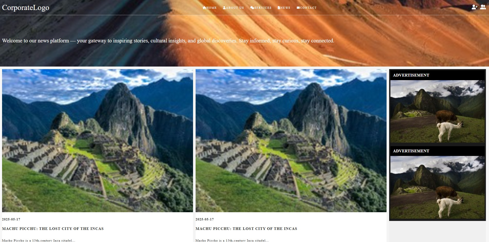

# 📰 News Website – HTML & CSS Project

This is a responsive news website created using only HTML and CSS.  
It demonstrates my ability to build a well-structured layout using semantic HTML, Flexbox, and media queries for responsiveness.

## 🔧 Technologies Used
- HTML5
- CSS3
- Flexbox
- Media Queries

## 🎯 Features
- Responsive layout for desktop and mobile
- Header navigation bar with icons
- Article grid section
- Sidebar for ads or extra content
- Styled footer

## 📷 Preview

## 🚀 Live Demo
👉 [View Site on GitHub Pages](https://henrygarrafa.github.io/html-css-news-website/)

## 👨‍💻 Developed by
Henry Garraffa
